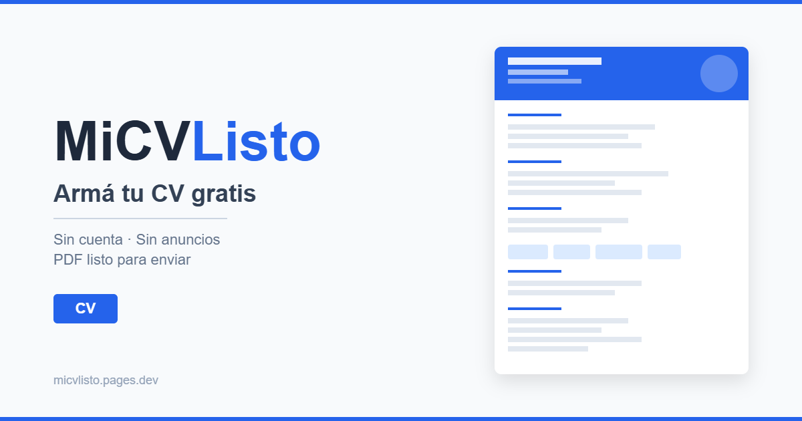

# MiCVListo

MiCVListo es una herramienta web gratuita para crear un CV profesional de forma simple, sin cuenta obligatoria, sin anuncios y con descarga en PDF A4 listo para enviar.

La app está pensada especialmente para personas que buscan trabajo y necesitan una guía clara para armar su CV, incluso si no tienen experiencia formal, están buscando su primer empleo o vienen de trabajos informales.

**App en producción:** https://micvlisto.pages.dev



## Estado actual

**MVP publicado y operativo.**

Actualmente permite:

- Crear un CV desde un wizard guiado.
- Elegir entre modos: experiencia laboral, primer empleo o experiencia informal.
- Guardar el borrador localmente en el navegador.
- Cargar una foto opcional procesada en el navegador.
- Usar ayudas tipo “No sé qué poner” para redactar mejor algunas secciones.
- Ver una vista previa del CV.
- Descargar un PDF A4 con texto seleccionable, sin login.
- Compartir el PDF como archivo en navegadores compatibles.
- Consultar una guía breve para armar un mejor CV.
- Registrar métricas anónimas de uso para mejorar la herramienta, sin guardar el contenido del CV.
- Usar la app sin anuncios, pagos ni suscripciones.

## Principios del proyecto

- **Gratis:** no hay pagos, planes premium ni anuncios.
- **Sin cuenta obligatoria:** el usuario puede crear y descargar su CV sin registrarse.
- **Local-first:** mientras no exista login opcional, el borrador vive en el navegador del usuario.
- **Privacidad:** el contenido del CV, la foto y el PDF no se guardan en un servidor.
- **Métricas anónimas:** solo se registran eventos de uso agregables para entender si la herramienta funciona bien.
- **Accesibilidad práctica:** textos simples, pasos cortos y ayuda para personas que no saben cómo redactar su CV.
- **Costo operativo mínimo:** hosting estático, lógica en cliente y funciones serverless livianas.

## Funcionalidades principales

- Landing con propuesta de valor y mensajes de confianza.
- Wizard de carga de datos:
  - Datos personales.
  - Foto opcional.
  - Perfil.
  - Experiencia.
  - Educación.
  - Cursos y capacitaciones.
  - Habilidades.
  - Idiomas.
  - Disponibilidad.
  - Referencias.
  - Revisión final.
- Consejos suaves de validación para fechas, años, perfil y tareas de experiencia.
- Vista previa con plantilla clásica.
- Generación de PDF A4 desde el navegador.
- Opción de compartir PDF como archivo cuando el navegador lo permite.
- Página de privacidad.
- Página guía para orientar a quien nunca hizo un CV.
- Página 404 amigable.
- Metadata Open Graph para compartir el link.
- Favicon e imagen pública del proyecto.
- Dashboard privado de métricas anónimas de uso.

## Stack

- React
- Vite
- TypeScript
- React Router
- Zustand + persistencia local
- Zod
- CSS Modules + variables CSS
- `@react-pdf/renderer` para generar PDF con texto seleccionable
- Cloudflare Pages para deploy
- Cloudflare Pages Functions para endpoints serverless
- Cloudflare D1 para métricas anónimas
- GitHub Actions para CI/CD

## Requisitos

- Node.js 22 recomendado.
- npm.

## Comandos

```bash
npm install        # instalar dependencias
npm run dev        # servidor de desarrollo
npm run build      # typecheck + build de producción
npm run preview    # previsualizar el build
npm run typecheck  # chequeo de tipos
npm run lint       # ESLint
npm run format     # formatear con Prettier
```

## Estructura general

```txt
src/
  app/          router + componente raíz
  pages/        landing, crear, wizard, preview, privacidad, guía, admin
  features/     wizard, modelo de CV, motor de frases, analytics, template y PDF
  content/      sugerencias, plantillas de frases y contenido editable
  components/   UI reutilizable
  styles/       estilos globales y design tokens
functions/
  api/          endpoints serverless de métricas anónimas
public/
  _redirects    fallback SPA para Cloudflare Pages
  favicon.svg   ícono del sitio
  og-image.png  imagen para compartir en redes
```

## Privacidad y datos

MiCVListo está diseñado para no guardar el contenido del CV.

- El borrador se guarda en `localStorage` del navegador.
- La foto se procesa localmente con Canvas.
- El PDF se genera localmente en el navegador.
- No se venden datos.
- No hay anuncios.
- No se requiere login para crear o descargar el CV.
- No se guarda nombre, email, teléfono, foto, perfil, experiencias, referencias ni PDF.
- Se registran métricas anónimas de uso, como pasos visitados, modo elegido, descarga de PDF o errores técnicos.

## Analytics privado

El proyecto incluye un dashboard privado para entender si la herramienta se está usando y dónde pueden aparecer trabas.

El dashboard trabaja con eventos anónimos y agregables. No permite ver ni reconstruir el contenido de los CVs.

Configuración técnica documentada en [`docs/analytics-setup.md`](./docs/analytics-setup.md).

## Roadmap posible

Ideas para futuras fases:

- Login opcional con Google para guardar CVs entre dispositivos.
- Persistencia en Firestore solo para usuarios logueados.
- Más plantillas de CV.
- Mejoras visuales del dashboard, como filtros por fecha o gráficos simples.
- Exportar/importar borrador como archivo para usuarios que no quieran login.
- Pruebas específicas en Safari iOS.

## Documentación de planificación

El archivo [`PLAN.md`](./PLAN.md) conserva decisiones, análisis y planificación histórica del proyecto. Puede incluir ideas de roadmap o fases que todavía no están implementadas.

## Licencia

MIT. Ver [`LICENSE`](./LICENSE).
